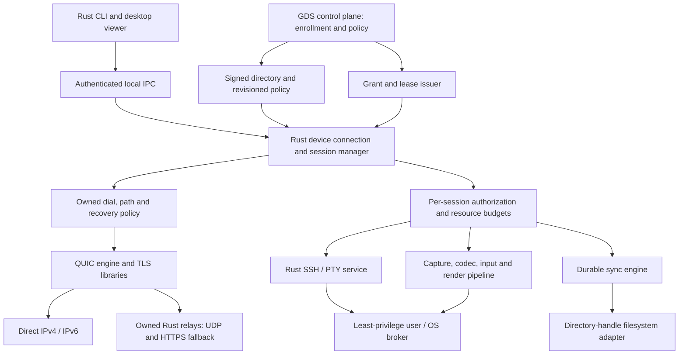

# RDS remediation and product completion plan

Date: 2026-09-24. Baseline: `87e7aeabaad861b0d3c63f6641c91539be19a3e0`.
Status: **in progress**. Current task results and remaining checks are in
[remediation-progress.md](remediation-progress.md). No whole wave is closed yet.
Evidence and finding IDs: [implementation/session audit](reports/rds-audit-20260924.md).
This plan supplements the original WS0–WS8 plan and reopens acceptance where
the audit found defects or missing evidence. Historical C0–C8 receipts remain
historical. New gate IDs below are proposed; register them in the runner
before invoking them. They are not existing `checkpoint.sh` commands.

## Product contract

The target is remote access and synchronization between enrolled Linux
x86_64 and macOS arm64 devices, coordinated by GDS: an interactive terminal,
a usable graphical desktop, and correct resumable file/directory operations.
Windows, browser access, stock RDP compatibility and multi-viewer broadcast
remain separate later milestones, not hidden conditions for initial release.

Required properties:

1. RDS owns application policy, wire contracts, device/session lifecycle,
   scheduling, permission checks and synchronization semantics in Rust.
2. Normal installation does not require SSH/VNC/RDP/FFmpeg command wrappers,
   a separately managed overlay VPN, or cloudflared. Rust libraries and thin
   OS/driver adapters are allowed; each non-Rust native dependency is explicit
   and replaceable. A literally all-Rust dependency graph is a separate target
   to evaluate, not a claim about OpenH264, ring or operating-system frameworks.
3. Device identity is stable, independently authenticated and revocable.
   Directory names, endpoint records and grants form one verified trust chain.
4. Direct paths minimize latency when usable; relay and HTTPS fallback provide
   reachability. Path changes do not silently change identity or policy.
5. Memory, tasks, descriptors, disk, queues and retry rates have explicit
   per-session and global budgets. Every resource has an owner and teardown.
6. Sessions state exactly what survives path loss, connection loss, process
   restart, policy expiry and device suspend. No blanket "seamless reconnect"
   claim conceals loss of a TCP stream or a remote process.
7. A completed transfer has a verified result and defined durability.
   Existing unrelated files are never deleted by staging/cleanup.
8. A feature is supported only when its real implementation and acceptance
   evidence exist on the relevant platform; scaffolds are shown as unavailable.

Keep iroh as the default/comparison until the owned lane passes the same
functional, hostile-input, NAT, performance and operational gates. Libraries
are implementation details behind owned interfaces; rewriting mature QUIC or
crypto is outside scope. The GDS adapter can cross the existing GDS language
boundary over typed APIs; this plan does not require rewriting GDS itself.

## Target component boundaries

Separate processes only when needed for user/privilege isolation. They share
versioned Rust contracts and authenticated IPC; do not create a daemon per
library abstraction. `rds-server` composes directory and relay listeners with
separate public and admin exposure. Device secrets/inventory remain in the
estate or local secure state, never in the public source repository.

## Execution order and dependency graph

| Wave | Outcome | Depends on | Scale | Finding coverage |
|---|---|---|---|---|
| W0 | Honest requirements and reproducible failure/measurement evidence | Baseline | S–M | Q01–Q05, O04 |
| W1 | Authorization, trust and filesystem safety repaired | W0 initial reproducers | L | A01–A07, S01–S06 |
| W2 | One configuration, protocol and lifecycle model | W1 contracts | L | A04, A08, T07–T10, O01 |
| W3 | Owned connectivity works across real network failures | W0 harness, W1, W2 | XL | T01–T06, T08, Q01–Q04 |
| W4 | GDS device identity/policy lifecycle is operational | W1, W2; W3 for broad rollout | L | A04–A09, O01 |
| W5 | Native Rust terminal and SSH access | W1, W2, W4; test both transports | L | P01, T08, O03 |
| W6 | Correct interactive desktop on Linux X11 | W1, W2; W3 impaired lanes | XL | D01, D03–D09, P02 |
| W7 | Real macOS and Wayland backends | W6 common interfaces, W4 permissions | XL | D02, D07, D09, O03 |
| W8 | Durable file transfer and directory synchronization | W1, W2, W4 | XL | S01–S08 |
| W9 | Media extensions and controlled performance tuning | W3, W6, W7 | L–XL | D08–D10, P02 |
| W10 | Release, update, observability and operational qualification | Incremental from W0; closes after W3–W8 | L | O01–O05, Q05, P02 |

Scale denotes relative engineering scope, not a calendar promise. W1 safety
patches must not wait for a large architecture rewrite. W4/5/6/8 can be
separate workstreams once shared contracts stabilize; this table does not
authorize automatic delegation or simultaneous edits. Each task is a
reviewable change with its own tests and updated docs. Performance tuning
must follow correctness evidence, not obscure it.

## W0 — establish the real acceptance baseline

Proposed gate: `r0-evidence`. Primary areas: `rds-bench`, test harnesses,
`scripts/checkpoint.sh`, reports, roadmap and capability matrix.

| Task | Work | Acceptance/evidence |
|---|---|---|
| W0.1 | Turn R01–R10 into in-repository regression cases in the relevant crates as their fixes land. Preserve baseline observations in this dated audit. Add missing cases for D03 and concurrent Authz before refactoring. | Each test fails on the baseline for the intended reason and passes after its fix; no test asserts broken behavior as a success gate. |
| W0.2 | Correct throughput measurement to end at receiver byte/digest ACK; distinguish connect, authorization, first service byte and payload completion. | Truncated receiver or corrupted bytes fail; a large send window cannot fabricate throughput. Compare known-rate links. |
| W0.3 | Integrate owned relay into the benchmark world; enforce impairment below every selected path; include relay-only, direct upgrade and recovery scenarios. | No scenario silently switches to a clean address. Reports contain path IDs, actual counters, impairment seed and offered/delivered bytes. |
| W0.4 | Repair comparator and checkpoint feature selection. Reject absent metrics, nonfinite values, scenario failure, insufficient samples and incomparable profiles. | Negative fixtures fail the gate; the C1 command builds the required backend. New gate names registered once. |
| W0.5 | Version the capability and requirement matrix. Record implemented/experimental/stub and runtime prerequisites separately. | README/CLI Info/report agree; X11 init failure is an explicit skip and fails a required-X11 gate. |
| W0.6 | Create append-only machine-readable receipt schema. Include full SHA, dirty status, binary digest, lockfile/toolchain, features, OS/architecture, topology class, repetitions, failures, skips and budgets. | A report can be reproduced without private host identifiers. Historical reports are linked, not overwritten. |

Exit: truthful measurements and reproducible blockers; no claim of product
readiness. Continue existing fmt/clippy/test checks throughout all waves.

## W1 — close security and data correctness blockers

Proposed gates: `r1-auth-discovery`, `r1-filesystem`.
Primary areas: `rds-agent`, `rds-core::grant`, `rds-discovery`, `rds-sync`.

| Task | Work | Acceptance/evidence |
|---|---|---|
| W1.1 | Store revocations regardless of watcher presence; atomically subscribe/check at admission and process current state before awaiting updates. | R01 corrected; pre-first-session, concurrent admission/revoke, last-watcher-drop and multi-threaded race tests all deny/close correctly. |
| W1.2 | Make Authz an atomic transition with an RAII reservation and owned watchdog. Failed reply, cancellation or teardown cannot leave granted state or a leaked reservation. Recheck validity at every service admission. | R10 corrected; STOP/RESET before/during ACK, simultaneous grants, expired grant, connection-close race. Task and reservation counts return to zero. |
| W1.3 | Define signed name binding/snapshot response and verify it at the resolver with a configured trust anchor. Add directory HTTPS and DNS names without treating TLS as a replacement for signed identity. | R06 corrected; wrong name/key/issuer, expired snapshot, replay and redirect rejected. Pinned ticket/key remains usable according to offline policy. |
| W1.4 | Add durable snapshot revisions/epochs, maximum lifetime/skew and freshness checks; establish revocation staleness policy for startup, outage and restart. | R07 corrected; stale cache cannot authorize new privileged sessions. Older disk snapshot cannot undo newer revocation. Tests cover clock jumps and authority rotation. |
| W1.5 | Implement transactional directory records, monotonic delete tombstones and corruption refusal, plus quotas/expiry GC. Move blocking work off async accept loops. | R02 corrected; concurrent update/delete and crash/restart preserve revision. One untrusted publisher cannot starve enrolled-device renewals or exhaust disk. |
| W1.6 | Fix partial reuse: verified chunk bytes or immutable destination references must exist before `have` is advertised. | R03 corrected; middle-byte edit, insertion/deletion/size change, repeated chunks, mutated destination and resume all produce exact BLAKE3 content. |
| W1.7 | Replace deterministic staging filenames with uniquely owned exclusive temps; isolate cleanup from user data. | R04 corrected; pre-existing sibling/symlink/hardlink/temp collision remain intact, including interrupted cleanup. |
| W1.8 | Introduce directory-handle relative no-follow filesystem operations for destination and all journal descendants on Linux/macOS; validate roots once and bind operations to handles. | R05 corrected; pre-planted `parts`/metadata symlink and concurrent rename/symlink substitution cannot read/write outside the root. No unsafe fallback that silently follows paths. |
| W1.9 | Bind pull Offer/Done to requested path/root/transfer; count unique verified chunks; enforce every declared reader bound and absolute transfer/idle budgets. | Malicious safe-but-different path, duplicate indices, oversized bitmap, empty-batch loops, wrong Done digest and stalled peer fail without unrelated writes. |
| W1.10 | Add global destination/journal ownership and durable staging/commit order for the current single-file engine before expanding sync scope. | Concurrent peers cannot delete/overwrite each other's state. Process crash leaves either prior file or complete verified new file; temp/journal recovery is deterministic. |

W1.3 implementation constraint: return a proof for the requested name without
publishing the entire estate inventory to a lookup caller. Prepare individually
signed bindings at the registry issuer, with a versioned, domain-separated
payload covering name, endpoint key and validity; the directory keeps no issuer
secret. Provision the verifying key independently through GDS/configuration.
Missing anchors, unsigned legacy responses and mismatched names fail closed;
pinned ticket/key resolution remains a separate path. Snapshot revisions,
authority rotation and durable rollback protection are coordinated with W1.4.

W1.4 implementation order (required before claiming bounded revocation):

1. Define versioned, domain-separated snapshot metadata with authority/epoch,
   monotonic revision and bounded validity. Order updates by revision instead
   of second-resolution wall time; equal-revision differing content is an error.
   Link name proofs to the same defined authority/revision model.
2. Implement one durable acceptance transaction: verify and compare, write the
   signed snapshot and high-water mark through owned staging, sync/rename/sync,
   then publish runtime policy. A persistence failure cannot advance an
   in-memory cursor or reopen admission. Directory restart must not load an
   older bootstrap snapshot over its committed state.
3. Load verified policy before privileged admission. Missing, corrupt, expired
   or rolled-back state keeps admission closed. Keep revocation contents and
   freshness in one observable policy value; a failed fetch must never replace
   it with an empty denylist. Distinguish explicit local allowlist operation
   from managed grant mode rather than silently falling back between them.
4. Apply freshness at admission and during active sessions. A valid cached
   snapshot may be used only until its signed expiry; retries cannot extend
   that lease. Bound it with monotonic elapsed time as well as wall-clock
   checks so a backward clock step cannot lengthen access. Test forward steps,
   suspend/resume and the expiry boundary. Document the resulting worst-case
   revocation delay separately from the healthy poll interval.
5. Define authenticated authority rotation with explicit continuity and epoch
   rules. An unknown key, lower epoch, or cache deletion is not an automatic
   recovery path. Keep durable high-water marks protected by the local service
   identity; rollback of the entire trusted local state needs an external GDS
   anchor and must not be claimed solved by atomic file replacement alone.
6. Exercise network withholding/replay, restart with older bootstrap data,
   concurrent refresh/admission, failures at each persistence boundary,
   authority rotation and live-service closure. Reuse W1.1/W1.2 ownership;
   do not introduce a second independent authorization state machine.

Exit: all P0 trust/data failures corrected and demonstrated on both supported
OSes where applicable. Remaining P1 capability work stays visibly open.

## W2 — unify contracts, configuration and resource ownership

Proposed gate: `r2-session-core`. Primary areas: core/net/agent/CLI and small
new Rust modules only where a real ownership boundary is needed.

| Task | Work | Acceptance/evidence |
|---|---|---|
| W2.1 | Define typed configuration with explicit precedence, validation, feature/backend selection and schema version. Separate endpoint, authority, relay and service identities. | Unknown/misapplied flags fail; owned lane cannot silently ignore relay configuration. Config roundtrip and shipped example tests. |
| W2.2 | Introduce version/capability/limit negotiation before service use; stable wire tags, session/transfer IDs and protocol compatibility policy. | Current↔previous compatible peers work or fail before mutation with a clear version error; mixed desktop/sync sessions route by ID. |
| W2.3 | Define grants bound to subject, audience device, tenant/policy revision, services/resources and session. Add read/write/view/control scopes and renewable lease state. | Cross-device grant replay fails; scope reductions take effect; renewal does not widen access. Expiry closes affected service despite stalled control I/O. |
| W2.4 | Make a local manager own stable identity and endpoints; CLI/viewer use peer-credential checked Unix IPC or the platform equivalent. | Parallel CLI/viewer calls do not replace each other's relay registration. Unauthorized local user cannot borrow identity or access sessions. |
| W2.5 | Introduce structured task groups/cancellation and budgets for peers, streams, tags, pending writes, frames, sync disk jobs and relay queues. | Slow-peer/stream-open storm tests show bounded RSS/FD/tasks; disconnect cancels and joins work; no residual connection-driver tick. |
| W2.6 | Define timeout classes and retry semantics: dial, handshake, Authz, idle, progress and shutdown. Use bounded exponential backoff with jitter and cancellation. | Startup works with directory/relay unavailable; shutdown never waits for an unbounded online/open/write future; no reconnect storms. |
| W2.7 | Own endpoint/address/service/frame types; isolate iroh/noq and native adapters; move async framing out of the documented runtime-free type layer or explicitly revise that contract. | Layer checks and feature-isolated builds; service crates do not depend on backend-specific path/address representation. |
| W2.8 | Add session correlation and structured lifecycle events with typed reason codes, key-safe diagnostics and measured stage timestamps. | One trace explains dial→grant→service→migration→close across components without secrets or private filenames by default. |

## W3 — complete owned connectivity and recovery

Proposed gate: `r3-connectivity-parity`. Scope: net/noq, relay, server, bench.

| Task | Work | Acceptance/evidence |
|---|---|---|
| W3.1 | Fix candidate collection and race: usable scoped IPv4/IPv6 addresses, dead-candidate deadlines, independent relay bootstrap. No loopback/synthetic addresses in remote advertisements. | R09 corrected. First candidate blackholed, v6-only/v4-only, stale LAN address, different LANs and no direct candidates all reach a valid path. |
| W3.2 | Integrate owned relay into server/CLI config with persisted relay identity, peer admission, bounded framing and startup health. Require explicit development configuration for open relay mode. | Real binaries start/attach/connect using owned relay; production defaults deny unknown peers; malformed/oversized register and silent peer terminate within budget. |
| W3.3 | Fix shared control framing; implement warm secondary relay/path, drain notice, migration and orderly detachment. | R08 corrected; receipt proves client observed Drain/PeerGone. Kill/drain primary during SSH, video and sync; surviving path carries traffic within defined interruption budget. |
| W3.4 | Design relay map/federation semantics: peers on different home relays must find a common route; authenticate relay membership and limit forwarding amplification. | Disjoint-home-relay peers connect; removed relay cannot rejoin with stale authority; forwarding loops and unbounded fanout refused. |
| W3.5 | Add in-process Rust TLS transport on TCP 443 (e.g. bounded WebSocket/HTTP framing), preserving endpoint-to-endpoint encryption and stable identity. Include explicit proxy configuration if required by deployment. | With all UDP blocked, terminal and sync work and video degrades explicitly. Test proxy idle timeout, frame caps, reconnect, slow consumer and TLS trust failure. |
| W3.6 | Implement validated path selection with hysteresis and per-service scheduling; prune failed candidates. Isolate relay socket failure from live direct sockets. | Flapping RTT does not churn paths; relay failure cannot poison direct I/O; task/candidate counts plateau across thousands of short sessions. |
| W3.7 | React to interface/address changes, Wi-Fi↔Ethernet, NAT rebinding, suspend/resume and changed default route. Define MTU discovery/fragmentation behavior for each carrier. | Deterministic simulated events plus real Linux/macOS transitions; connection/session state correctly recovers or reports interruption. |
| W3.8 | Build the full topology matrix: loopback, LAN, two NATs, symmetric NAT/CGNAT where available, UDP blocked, IPv6, asymmetric loss, relay only, relay death and directory outage. | Same scenarios run on iroh and owned lanes; missing topology is NOT RUN, not inferred from a same-network cloud receipt. |
| W3.9 | Implement service-aware recovery over a replacement connection, including lease refresh and replay-safe operation IDs. | Resumable transfer resumes verified chunks; desktop requests fresh IDR/state; generic TCP is reported interrupted; no duplicate exec/mutation on retry. |
| W3.10 | Evaluate warm paths/session resumption and BBR/window/QoS settings after correctness. Keep unsafe/replayable early operations disabled. | Cold and warm p50/p95/p99, CPU/battery/FD cost, real bulk+interactive contention and fairness recorded. Promote owned default only after parity gate. |

Cloudflare experiment, if later justified: run the same matrix with direct,
owned relay, Tunnel/private routing and Cloudflare One Client configurations.
Measure actual connect and presentation latency, route changes, recovery,
device enrollment and dependency costs. Do not embed a cloudflared/WARP
requirement into core APIs, or infer general UDP support from public-hostname
TCP routing. See the audit's official source links for the distinction.

## W4 — connect RDS policy to GDS end to end

Proposed gate: `r4-enrollment-policy`. Public Rust adapter contracts; private
estate configuration and authority material stay outside this repository.

| Task | Work | Acceptance/evidence |
|---|---|---|
| W4.1 | Specify enrollment request/proof/approval and persistent device record with key rotation/recovery. Use the existing estate identity model rather than an unrelated second inventory. | New device obtains a scoped identity; unapproved or replayed enrollment fails; rotation preserves intended device relation without accepting old credentials. |
| W4.2 | Implement authority APIs and Rust client for signed registry, grants, lease renewal and revocation. Protect issuer keys and separate signer/admin exposure from public relay. | Enroll→resolve→authorize→renew→revoke executed from clean state; no hand-edited grant JSON or manual allowlist drift needed. |
| W4.3 | Reconcile revisioned desired policy to agents/relays with acknowledgment and last-applied status; specify disconnect/offline behavior. | Out-of-order delivery/restart cannot roll policy back; live session narrows/closes on revocation; unreachable devices are visibly stale. |
| W4.4 | Add policy integration tests for Linux/macOS account, display and filesystem scopes, user consent/unattended profiles and concurrent roles. | View-only cannot inject input; file-read cannot write; PTY grant cannot open unrelated TCP; another device/tenant grant is rejected. |
| W4.5 | Define deployment/readiness receipts and integrate GDS status with exact RDS build and active policy revision. | Source pin, installed digest, running digest and applied policy are separately observable; version string alone is insufficient. |

## W5 — deliver native Rust SSH and terminal access

Proposed gate: `r5-ssh`. Evaluate `russh` as a library, behind an owned service
interface. Keep the current TCP tunnel as optional compatibility/migration.

| Task | Work | Acceptance/evidence |
|---|---|---|
| W5.1 | Implement native client over RDS streams with strict host-key verification, authenticated endpoint binding and bounded SSH algorithm policy. | `rds ssh <device>` opens a terminal without invoking an external SSH executable; wrong/rotated host key requires the defined verified rotation path. |
| W5.2 | Implement Rust SSH server/session broker with target-account policy and privilege separation; decide how host SSH keys bind to device identity. | No dependency on sshd for the native mode; no inherited privileged shell or unchecked target user. Linux/macOS account isolation tests. |
| W5.3 | Support PTY allocation, terminal size changes, raw mode restoration, UTF-8, signals, exec exit status, stdin/stdout/stderr and cancellation. | Interactive shell, full-screen TUI, command streaming and Ctrl-C/window resize work locally and through each network path. Terminal restored on error/disconnect. |
| W5.4 | Define reconnectable managed PTY sessions with scoped IDs, bounded scrollback and explicit process survival policy. Keep generic TCP interruption truthful. | Disconnect/reconnect attaches to the authorized live PTY where supported; revoked user cannot reattach; retries never run an exec twice. |
| W5.5 | Bound port forwarding and any agent/file subsystem access; add standard SSH client interoperability as an optional adapter. | Default denies out-of-scope forwarding; explicit tests for destination/DNS rebinding constraints; no implicit SSH-agent forwarding. |
| W5.6 | Test multi-hour lease-renewed interactive sessions with simultaneous video/sync and transport changes. | No unexplained five-minute cutoff, stuck terminal, orphan PTY or uncontrolled reconnect; completion receipt includes failure and recovery counts. |

## W6 — make the desktop pipeline correct and usable

Proposed gate: `r6-desktop-x11`. X11 first provides a complete reference path;
its abstractions must support macOS/Wayland without X11-specific assumptions.

| Task | Work | Acceptance/evidence |
|---|---|---|
| W6.1 | Correct `send_frame` cancellation and reference-dependent drop/resync behavior. Limit IDR requests and refuse delta presentation until decoder state is valid. | Large payload byte-exact tests and real H.264 sequences under loss, reordering, reset and producer shutdown; no duplicated prefix or persistent black screen. |
| W6.2 | Bound reader/decode/presentation tasks and bytes; isolate codec work from Tokio workers; validate dimensions/stride/format and session IDs. | Slow decoder, huge header, u64 boundary, many incomplete streams and repeated sessions stay within budget and stop promptly. |
| W6.3 | Implement Rust window/event loop and newest-frame GPU presentation, independent of capture backend. Add display/session selection and connection/permission/error state. | User can see and control the target without diagnostic-only CLI output; first presented frame and display refresh timestamps are measured. |
| W6.4 | Correct evdev↔X11 key/button mapping and absolute/relative pointer semantics, scroll/flush, per-seat ownership and ACK semantics. | Automated target app observes intended events; left/right buttons and modifiers work; wrong display denied; held keys released after disconnect/focus loss. |
| W6.5 | Support Unicode/layout/IME strategy, cursor shape/hotspot/position, DPI and monitor geometry, resize and screen changes. | Two monitors with unequal scale, negative origins, resize and layout changes preserve correct visible target and pointer position. |
| W6.6 | Replace 25 ms idle polling with event-driven wakeups; measure actual capture→convert→encode→send→decode→present stages. | Damage wake latency measured without shifting capture timestamps; static screen reduces CPU without adding an unreported interaction delay. |
| W6.7 | Unify bitrate/grant ceiling/controller state, minimum supported rate rejection, path-epoch reset and encoder reconfiguration. | No byte-rate policy bypass below encoder floor; transitions avoid repeated IDR storms; QoS protects input/SSH while sync saturates the link. |
| W6.8 | Add real pixel and input-to-visible test harness, not only synthetic headers. Include codec recovery, visual quality and long-duration operation. | Required tests fail if capture/injection/rendering never happened; p95/p99 and displayed/dropped/invalid frames reported with CPU/RSS/FD. |

## W7 — implement native macOS and Wayland support

Proposed gates: `r7-macos`, `r7-wayland`; separately declared hardware profiles.

| Task | Work | Acceptance/evidence |
|---|---|---|
| W7.1 | Implement ScreenCaptureKit capture and lifecycle in a user-session Rust broker with typed CPU/GPU frame surfaces. | Real macOS arm64 capture, monitor/window selection, resize, lock/unlock, permission denial/regrant and suspend/resume; no false capability on a stub. |
| W7.2 | Implement VideoToolbox encode/decode with bounded asynchronous callbacks and optional zero-copy surfaces. Retain a measured software fallback. | H.264 interop with Linux viewer, format/color validation, bounded memory and no dead callbacks after disconnect. |
| W7.3 | Implement CGEvent input and accessibility/TCC handling, keyboard/layout mapping and release-all state. | Actual application receives input only after permission; revoked permission stops injection with visible status. |
| W7.4 | Deliver stable signed macOS application/helper identity and launchd/user-session lifecycle suitable for TCC. | Upgrade retains the intended permission identity; startup/login/logout and removal leave no orphan privileged helper. |
| W7.5 | Implement Wayland capture via supported image-copy path and portal/PipeWire fallback; implement input via portal/EIS as available. Handle portal session restore/revocation. | Real supported compositors exercised; unavailable protocol falls back with reason; no shelling out to capture/input utilities. |
| W7.6 | Evaluate DRM/KMS capture and uinput only as explicitly privileged unattended profiles, with seat ownership and restricted broker APIs. | Ordinary desktop mode does not require blanket root/device access. Profile capability/permission tests prevent cross-seat injection. |
| W7.7 | Wire the probe order into actual capabilities and session construction; distinguish absent backend, denied permission and runtime failure. | Backend failure proceeds only to an allowed fallback; logs/capabilities match the chosen path on both OSes. |

## W8 — finish transfer semantics and directory synchronization

Proposed gates: `r8-transfer`, then `r8-directory-sync`. Do not mix a new
two-way engine into the small P0 journal fixes from W1.

| Task | Work | Acceptance/evidence |
|---|---|---|
| W8.1 | Complete crash-consistent journal transactions, durable Done, verified immutable chunk reuse and cross-transfer concurrency. | Real sender/receiver process kills at 20 seeded progress points on a 1 GiB file; disk-full, permission error, torn metadata and restart preserve exact data. |
| W8.2 | Define changing-source behavior, overwrite/conflict policy, cancellation and safe journal GC/quotas. Report logical, reused, wire and committed bytes separately. | Concurrent edits do not silently overwrite newer destination content; canceled transfer preserves unrelated state; stale state cannot exhaust configured disk quota. |
| W8.3 | Implement bounded parallel receive/write with verified stream/index ownership and fair scheduling. | Throughput uses receiver completion, memory stays bounded, desktop/SSH latency remains within the contention budget. |
| W8.4 | Add recursive directory manifest/index, watch plus reconciliation scan, rename/delete tombstones and reconnect recovery. | Missed filesystem events are repaired by scan; offline changes converge after reconnect; deletion is authorized and not inferred from an incomplete scan. |
| W8.5 | Define two-way conflict and metadata model: modes, mtimes, symlinks, hardlinks, sparse files, case sensitivity, Unicode normalization and unsupported attributes. | Linux↔macOS fixtures roundtrip or produce explicit supported-conflict outcomes; divergent writes retain both versions according to policy. |
| W8.6 | Provide dry-run/change preview, filters, progress and per-root limits through native CLI/UI/GDS APIs. | User can inspect planned deletes/conflicts before applying the selected policy; progress survives reconnect and errors identify the failed operation. |

## W9 — media completeness and measured optimization

Proposed gate: `r9-media`. Initial desktop correctness remains independently
shippable; optional extensions must not delay closing security defects.

| Task | Work | Acceptance/evidence |
|---|---|---|
| W9.1 | Implement scoped audio capture/playback, codec adapter, bounded jitter buffer and A/V clock synchronization. | Linux/macOS roundtrip, drift, loss and device-change tests; microphone permission separate from desktop view. |
| W9.2 | Add scoped clipboard and file-drop transfer via existing sync authorization, size/type limits and loop prevention. | View-only cannot read/write clipboard; clipboard cycles and oversize data bounded; file drops obey destination policy. |
| W9.3 | Implement measured hardware codec backends (VideoToolbox first on macOS; supported VAAPI/Vulkan paths on Linux) with software fallback. | Quality/latency/CPU/power results per GPU/driver; failure recovers without leaking surfaces or lying about capabilities. |
| W9.4 | Evaluate FEC, pacing, codec tiers and adaptive resolution only against valid decoded-frame/quality data. | Controlled experiments show improvement in the stated profile; no blanket BBR/FEC/window setting claimed optimal for all networks. |
| W9.5 | Evaluate a stricter Rust-only dependency profile if still required after documenting OS/native boundaries. | Enumerate native objects/build tools in SBOM and measure any substitute's correctness/performance; unsupported profiles remain explicit. |

## W10 — operations, release and final qualification

Proposed gate: `r10-release`. Build operational pieces incrementally; this is
the final system acceptance, not permission to postpone observability.

| Task | Work | Acceptance/evidence |
|---|---|---|
| W10.1 | Export agent/relay/directory/session metrics on a dedicated secured admin surface: phase latency, path migration, lease freshness, decode/present/drop, transfer progress, resource counts and reason-coded failures. | Metrics match controlled known traffic and include closed/short paths; local reverse proxy cannot expose admin routes inadvertently. |
| W10.2 | Add redacted diagnostic bundle and GDS status for build, policy, backend availability and permission problems. | A failed connect/black screen/stalled transfer can be localized without raw secrets, user file contents or unconstrained logs. |
| W10.3 | Pin tested toolchain/lockfile policy and produce actual Linux x86_64/macOS arm64 artifacts with digest, SBOM, provenance and signature verification. Embed commit/features/protocol. | Clean-machine install uses correct `rds` binary name; verify artifacts from a real release workflow, not just its YAML. |
| W10.4 | Implement bounded graceful drain/update, atomic binary activation and tested rollback with protocol/state compatibility rules. | Update failure/kill/old peer can roll back without lost keys or corrupt sync state; source pin and running digest reported independently. |
| W10.5 | Ship tested systemd and launchd/user broker configurations, least-privilege device access, readiness/health and firewall docs. Remove stale CLI examples. | Commands/unit files exercised on supported hosts; startup without optional network components remains controllable; clean stop leaves no tasks/sockets. |
| W10.6 | Schedule feature-matrix CI, stateful fuzz/property/model tests, long impairment/soak and dependency/license review. | Stub/early-return tests cannot satisfy native capability gates. Dependency exceptions have owner/reason/review date; cross-platform feature regressions fail CI. |
| W10.7 | Run release qualification using existing authorized devices: LAN/WAN/NAT paths, shared-link SSH+desktop+sync, renewal/revocation and failure matrix. | Exact-build receipts for every required row; unsupported topology explicitly pending. No readiness claim based on a source pin or one-hour ping/tunnel smoke alone. |
| W10.8 | Refresh GDS anchor/entrypoints/capabilities, regenerate related projections and reconcile invariant-specific checks, main ruleset and estate CI-feedback integration. Preserve the owner policy of asynchronous general CI. | Metadata points to existing workspace entrypoints; any designated blocking check protects an actual invariant; ordinary CI is not a blanket merge barrier; estate receives the defined workflow evidence. |

## Performance and stability acceptance

Targets below define measurements and qualification work, not achieved
performance. Retain original ambitions as targets; do not loosen a failing
gate until it passes without an explicit requirement decision and rationale.

| Metric | Required measurement / initial target |
|---|---|
| Setup | Separate cold/warm resolve→dial→handshake→grant→first useful service. Preserve the original clean controlled-profile p50 ≤300 ms objective; publish p95/p99 and failures, not just successful median. |
| Desktop | Preserve ≤20 ms LAN / ≤80 ms WAN at 1080p60 as aspirational glass-to-glass targets for declared hardware/network profiles. WAN target is meaningful only where propagation/RTT permits it. Measure actual presentation and input-to-visible pixels. |
| Impairment | Original p95 ≤150 ms media objective under the declared 5% loss/30 ms jitter profile remains unproven. Include base delay and direction; report recovery, quality and dropped/decoded frames. Existing ≤2/3 s header tails do not close it. |
| Contention | Run interactive SSH/input/media while sync fills the link in both directions. Report service-specific tails and bulk goodput, not aggregate throughput alone. |
| Migration | Proposed initial acceptance: warm-path migration has no session recreation and ≤1 s service interruption; dial/reconnect ≤5 s when a healthy reachable fallback already exists. Treat these as targets to validate by profile, not global network guarantees. |
| Sync | Every completed file has verified digest and declared durability; actual process crash recovery and safe conflict outcomes. No data-loss allowance. |
| Resources | Establish idle/active budgets per declared device. 30-minute required media gate, 24-hour combined-service qualification, repeated session/network churn; no unbounded upward RSS/FD/task/disk trend. |
| Authorization | Revocation/expiry and lease freshness checked under idle/blocked I/O, startup, outage and restart. Set a documented maximum revocation propagation budget after the policy transport is selected; polling interval alone is not an outage guarantee. |

Timestamp model: use monotonic time within a process; estimate inter-device
offset/uncertainty for cross-device stage telemetry, and use optical or
instrumented pixel measurements for final glass-to-glass evidence. Capture
timestamps must include capture work. One-way latency cannot be obtained by
subtracting unsynchronized host clocks or reusing ping RTT.

Minimum network matrix crosses **both transport lanes**, **both OSes**, direct
and relay modes, loss/jitter/rate profiles, UDP-blocked fallback, directory
failure, expired policy, relay drain/death, address change and device suspend.
Run only meaningful supported combinations; mark the rest unavailable rather
than fabricate Cartesian coverage. Do not create or rent new hosts silently
to fill a matrix row.

## Change and completion discipline

Each implementation PR must name task/finding IDs, explain changed behavior,
include the regression/acceptance evidence and update capability documentation.
Use the module's fmt, default/X11/all-relevant-feature clippy and workspace
tests; run cargo-deny when available and the registered wave gate at closure.
Linux-only validation never closes a macOS native feature. Use signed
Conventional Commits and the existing pull-request-only main workflow when
changes are ready for that stage.

Keep current safe behavior available behind a documented migration switch
until replacement passes parity. Never roll back security/data fixes just to
recover an old performance number. Breaking wire/state changes need a
compatibility and rollback plan before deployment.

The first implementation sequence is W0.1 plus W1.1/W1.2 (revocation and
authorization), W1.3 (name trust), W1.6–W1.9 (file correctness/confinement),
then W3.1 (dial fallback), with W0 measurement repairs alongside. Each can be
reviewed as a bounded patch. The rest of the plan builds on these invariants.
